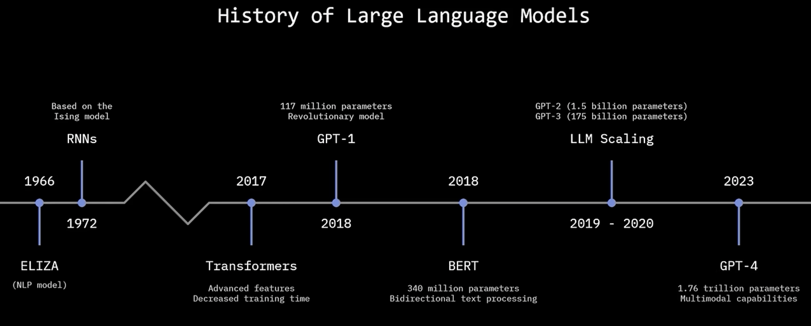
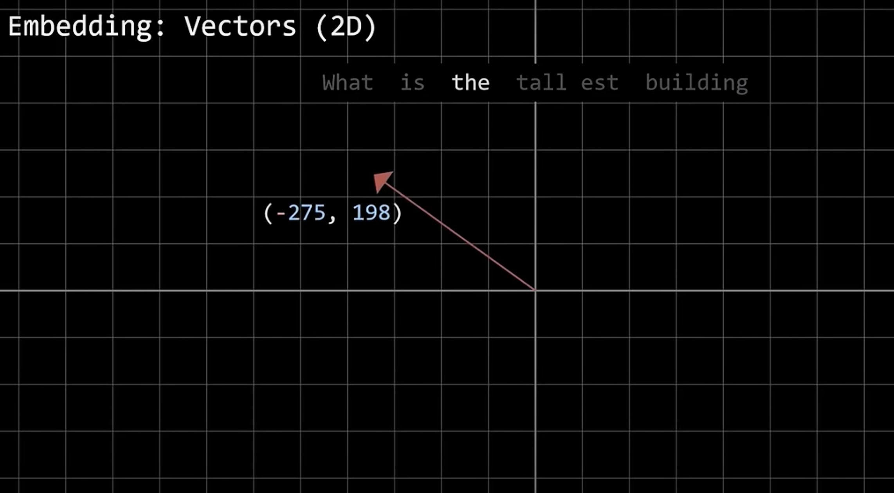
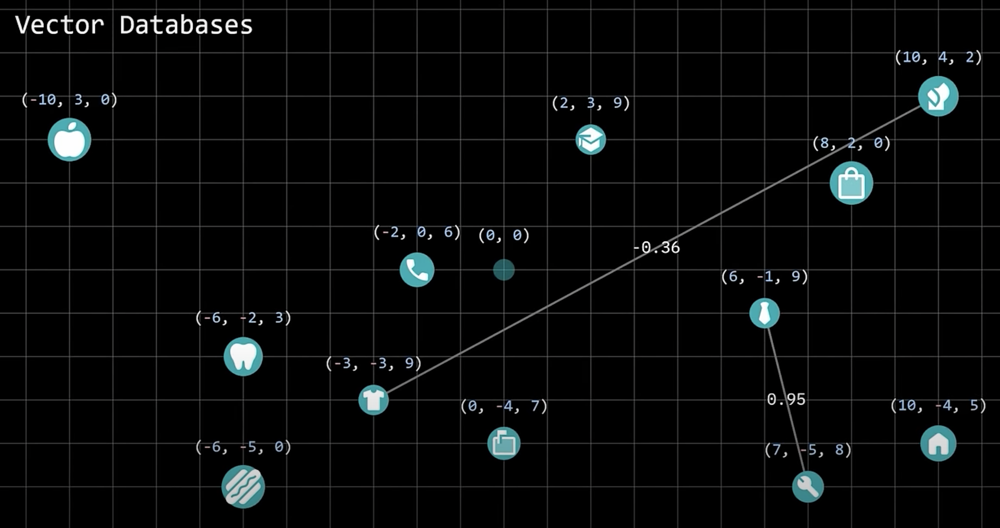

# Large Language Models (LLMs)

### Neural Network
- It is series of algorithms that try to recoginize patterns in data
- LLM are specific type of Neural network that focus on understanding nautural language and it is trained on any text type data available on internet

### Why LLM?
- Today we are teaching computer how to do things (by coding)
- Using LLM we can teach computer how to learn things to do things

### How LLM Works
- Tokenization:
    - There are neural networks that are training to split long text into individual tokens
    - It also sperates the suffix and prefix of the word
        - What is the tallest building?
        - what is the tall est building (6 tokens)
    - this is done so that models can understand each word individually and grouping of words
- Embeddings:
    - Turns tokens into embedding vectors / numerical respresentation of those tokens
    - these numbers all correspond with the position in an embedding vector database
    
    - these Database is for storage and retreival mechanisms that are highly optimized for vectors
    
    - Vector database capture the relationship of data as vectors in multidimentional space
    - Vectors are objects with magniture and direction, which both influence how similar one vector is to another
    - capture semantic meaning
- Transformers:
    - Matrix representation can be made out of those vectors using multi-head attention
