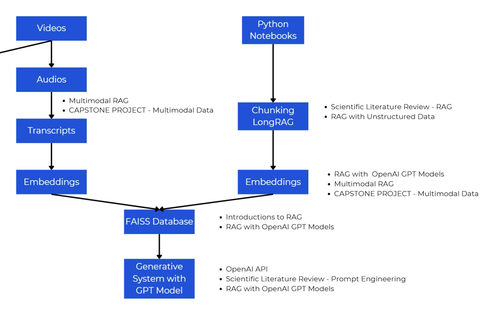

# RAG, AI Agents and Generative AI with Python and OpenAI 2025

## Important Key words
- Retrieval Model
  - Vector Space Model
  - Probabilistic Retrieval Model
- RAGs: Retrieval Agumented Generation System
  - Agentic RAG
- Prompt engineering
- Generative AI
- OpenAI
- Multimodal RAG
- AI Agents
- MCP
- chunking LongRAG
- Embeddings
- Generative System with OpenAI

## AI Tools
- https://streamlit.io
- https://course-assistant.streamlit.app/
- https://thedatahero.com/rag_generative_ai/

## Section1: RAG and Generative AI with Python

## Section3: Basic of Retrieval System for RAG and generative AI

### Game Plan for Fundementals of Retrieval Systems
- tokenize and preprocess text
- build and query inverted indexes
- apply retrival models
    - boolean
    - vector space
    - probalistic

### Overview of Information Retrieval (IR)
- Indexing
- Quering
- Ranking

### Understanding Tokenization in NLP
- word 
- sentence
- character